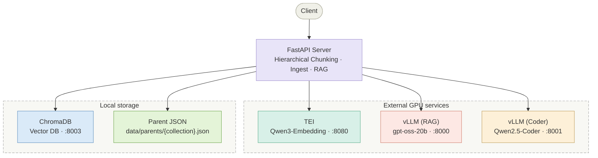
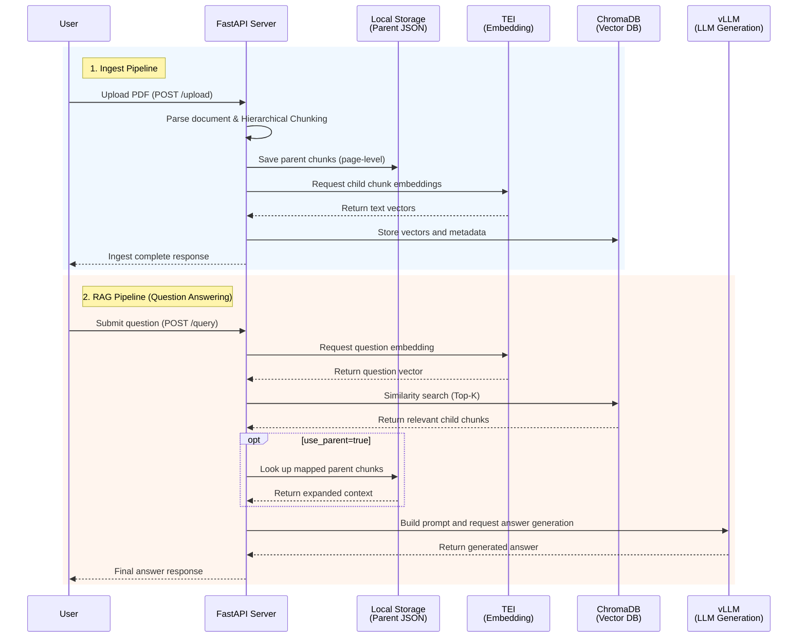

---

## FastAPI-based RAG API Server

---

## 🏗 System Architecture





---

## 💡 Key Features

| Feature | Description |
|---------|-------------|
| **Ingest** | Upload PDF → Hierarchical Chunking → TEI Embedding → Store in ChromaDB |
| **RAG Retrieve** | Embed question, perform vector search in ChromaDB, return relevant chunks |
| **RAG Query** | Use retrieved chunks as context, call vLLM, return final answer |
| **Collections** | CRUD management per ChromaDB collection and per file |

---

## 🔗 External Service Dependencies

| Service | Role | Model | Default Port |
|---------|------|-------|--------------|
| **ChromaDB** | Vector database | — | `8003` |
| **TEI** | Text embedding generation | `Qwen3-Embedding` | `8080` |
| **vLLM (LLM)** | RAG answer generation | `gpt-oss-20b` | `8000` |
| **vLLM (Coder)** | Code generation | `Qwen2.5-Coder-7B-Instruct` | `8001` |

> ⚠️ **Note**: TEI and vLLM are assumed to be running on separate Linux GPU servers. Configure the host and port for each server in the `.env` file.

---

## 📁 Project Structure

```text
Server/
├── .env                        # Environment variables (server connection info, etc.)
├── docker-compose.yml          # ChromaDB container configuration
├── requirements.txt            # Python dependency list
│
├── data/
│   ├── chroma_index/           # ChromaDB local persistent data
│   └── parents/                # Parent chunk JSON ({collection_name}.json)
│
└── src/
    ├── main.py                 # FastAPI app entry point
    │
    ├── core/
    │   └── config.py           # pydantic-settings based configuration management
    │
    ├── api/v1/
    │   ├── ingest/
    │   │   ├── router.py       # Document ingest endpoints
    │   │   └── schemas.py      # Request/response Pydantic models
    │   └── rag/
    │       ├── router.py       # RAG search/generation endpoints
    │       └── schemas.py      # Request/response Pydantic models
    │
    ├── services/
    │   ├── ingest_service.py   # DB storage and deletion management
    │   ├── rag_service.py      # Retrieval and generation logic
    │   ├── embed_service.py    # TEI API integration
    │   └── document_service.py # PDF parsing and Hierarchical Chunking logic
    │
    └── prompts/
        ├── loader.py           # Jinja2 template loader
        ├── rag_prompt.j2       # RAG general Q&A prompt
        └── sql_prompt.j2       # (Reserved) Text-to-SQL prompt
```

---

## 🚀 Quick Start

### 0. Prerequisites

- Python 3.10 or higher
- Docker and Docker Compose (for running ChromaDB)

### 1. Configure Environment Variables

Create a `.env` file in the project root and fill in the values below. (When entering URLs, provide only the IP or domain — do not include the protocol such as `http://`.)

```env
# ChromaDB Settings
CHROMA_HOST=localhost
CHROMA_PORT=8003
CHROMA_COLLECTION_NAME=default

# TEI (Text Embeddings Inference)
TEI_HOST=<TEI server IP>
TEI_PORT=8080

# vLLM - RAG LLM
VLLM_LLM_HOST=<vLLM server IP>
VLLM_LLM_PORT=8000
VLLM_LLM_SERVED_MODEL_NAME=gpt-oss-20b

# vLLM - Coder LLM
VLLM_CODER_HOST=<vLLM server IP>
VLLM_CODER_PORT=8001
VLLM_CODER_SERVED_MODEL_NAME=qwen2.5-coder-7b-instruct

# App Server Settings
APP_HOST=0.0.0.0
APP_PORT=9000
```

### 2. Start ChromaDB

```bash
docker-compose up -d chromadb
```

### 3. Install Python Packages

```bash
pip install -r requirements.txt
```

### 4. Run the Server

```bash
python -m src.main
# or
uvicorn src.main:app --reload --host 0.0.0.0 --port 9000
```

### 5. Check API Documentation

Once the server is running, visit the links below for interactive API docs:

- Swagger UI: [http://localhost:9000/docs](http://localhost:9000/docs)
- ReDoc: [http://localhost:9000/redoc](http://localhost:9000/redoc)

---

## 📖 API Endpoints

### 1. Ingest (Document Ingestion)

| Method | Endpoint | Description |
|--------|----------|-------------|
| `POST` | `/v1/ingest/upload` | Upload PDF → Chunk → Embed → Store in DB |
| `GET` | `/v1/ingest/collections` | List all collections |
| `GET` | `/v1/ingest/collections/{name}/files` | List files in a collection |
| `DELETE` | `/v1/ingest/collections/{name}` | Delete an entire collection |
| `DELETE` | `/v1/ingest/collections/{name}/files/{file}` | Delete chunk data for a specific file only |

**Upload Request Example (multipart/form-data)**

```
file: document.pdf
collection_name: default   # Optional, default: CHROMA_COLLECTION_NAME from .env
chunk_size: 500            # Optional, child chunk size, default: 500
chunk_overlap: 50          # Optional, overlap between chunks, default: 50
```

### 2. RAG (Retrieval and Question Answering)

| Method | Endpoint | Description |
|--------|----------|-------------|
| `POST` | `/v1/rag/retrieve` | Vectorize question, search for relevant chunks, return context only |
| `POST` | `/v1/rag/query` | Search chunks, then generate a final answer via LLM |

**`/v1/rag/retrieve` Request Body**

```json
{
  "question": "How do I apply for logistics?",
  "collection_name": "default",
  "top_k": 5,
  "use_parent": false
}
```

**`/v1/rag/query` Request Body**

```json
{
  "question": "How do I apply for logistics?",
  "collection_name": "default",
  "top_k": 5,
  "use_parent": true,
  "temperature": 0.1,
  "max_tokens": 1024
}
```

---

## 🧠 Hierarchical Chunking Structure

Documents are managed in two stages to achieve both fine-grained retrieval and broad contextual understanding simultaneously.

```
[Parent Chunk: page-level]  →  Stored in local storage (data/parents/{collection}.json)
    │
    ├── [Child Chunk 1]     →  TEI Embedding → Stored in ChromaDB (vector search target)
    ├── [Child Chunk 2]     →  TEI Embedding → Stored in ChromaDB
    └── [Child Chunk 3]     →  TEI Embedding → Stored in ChromaDB
```

- **Retrieval**: Finds the child chunks most semantically similar to the question.
- **Generation**: When `use_parent: true` is set, the parent chunk (full page text) that the child chunk belongs to is passed as LLM prompt context — overcoming the limitations of narrow retrieval and providing broader context.

---

## 🛠 Tech Stack

| Item | Technology |
|------|------------|
| Framework | FastAPI |
| Vector DB | ChromaDB (HttpClient API) |
| Embedding | TEI (Text Embeddings Inference) |
| LLM Inference | vLLM (OpenAI-compatible API) |
| Document Parsing | pypdf |
| Prompt Template | Jinja2 (`.j2`) |
| Config/Validation | pydantic & pydantic-settings |
| Infra | Docker, Docker Compose |
