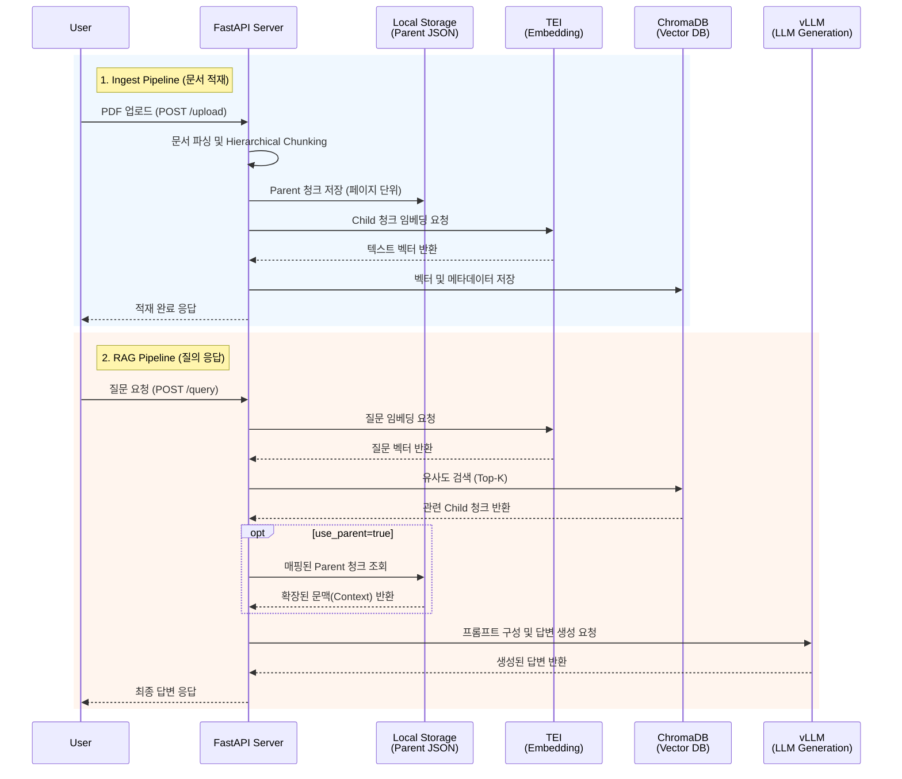

> FastAPI 기반 RAG AI 서버 — PDF 문서를 벡터DB에 적재하고, LLM을 활용한 질의응답 기능을 제공합니다.
> 계층적 청킹(Hierarchical Chunking) 전략으로 검색 정확도와 문맥 유지력을 높였습니다.

---

## 🏗 시스템 아키텍처



---

## 💡 주요 기능

| 기능 | 설명 |
|------|------|
| **Ingest** | PDF 업로드 → Hierarchical Chunking → TEI 임베딩 → ChromaDB 저장 |
| **RAG Retrieve** | 질문 임베딩 후 ChromaDB 벡터 검색, 관련 청크 반환 |
| **RAG Query** | 검색된 청크를 context로 vLLM 호출, 최종 답변 생성 |
| **Collections** | ChromaDB 컬렉션 및 파일 단위 CRUD 관리 |

---

## 🔗 외부 서비스 의존성

| 서비스 | 역할 | 모델 | 기본 포트 |
|--------|------|------|-----------|
| **ChromaDB** | 벡터 데이터베이스 | — | `8003` |
| **TEI** | 텍스트 임베딩 생성 | `Qwen3-Embedding` | `8080` |
| **vLLM (LLM)** | RAG 답변 생성 | `gpt-oss-20b` | `8000` |
| **vLLM (Coder)** | 코드 생성 | `Qwen2.5-Coder-7B-Instruct` | `8001` |

> ⚠️ **참고**: TEI와 vLLM은 별도의 Linux GPU 서버에서 실행 중인 서비스라고 가정합니다.
> `.env` 파일에서 해당 서버의 호스트와 포트를 설정해야 합니다.

---

## 📁 프로젝트 구조

```text
MOA-server/
├── .env                        # 환경변수 (서버 접속 정보 등)
├── docker-compose.yml          # ChromaDB 컨테이너 설정
├── requirements.txt            # Python 의존성 목록
│
├── data/
│   ├── chroma_index/           # ChromaDB 로컬 영구 데이터
│   └── parents/                # 부모 청크 JSON ({collection_name}.json)
│
└── src/
    ├── main.py                 # FastAPI 앱 진입점
    │
    ├── core/
    │   └── config.py           # pydantic-settings 기반 설정 관리
    │
    ├── api/v1/
    │   ├── ingest/
    │   │   ├── router.py       # 문서 적재 엔드포인트
    │   │   └── schemas.py      # 요청/응답 Pydantic 모델
    │   └── rag/
    │       ├── router.py       # RAG 검색/생성 엔드포인트
    │       └── schemas.py      # 요청/응답 Pydantic 모델
    │
    ├── services/
    │   ├── ingest_service.py   # DB 저장 및 삭제 관리
    │   ├── rag_service.py      # 검색(retrieve) 및 생성(generate) 로직
    │   ├── embed_service.py    # TEI API 연동
    │   └── document_service.py # PDF 파싱 및 Hierarchical Chunking 로직
    │
    └── prompts/
        ├── loader.py           # Jinja2 템플릿 로더
        ├── rag_prompt.j2       # RAG 일반 질의응답 프롬프트
        └── sql_prompt.j2       # (예비) Text-to-SQL 프롬프트
```

---

## 🚀 빠른 시작

### 0. 사전 요구사항

- Python 3.10 이상
- Docker 및 Docker Compose (ChromaDB 실행용)

### 1. 환경변수 설정

프로젝트 루트에 `.env` 파일을 생성하고 아래 양식에 맞게 입력합니다.
(URL 입력 시 `http://` 등 프로토콜을 제외하고 IP나 도메인만 입력하세요.)

```env
# ChromaDB Settings
CHROMA_HOST=localhost
CHROMA_PORT=8003
CHROMA_COLLECTION_NAME=default

# TEI (Text Embeddings Inference)
TEI_HOST=<TEI 서버 IP>
TEI_PORT=8080

# vLLM - RAG LLM
VLLM_LLM_HOST=<vLLM 서버 IP>
VLLM_LLM_PORT=8000
VLLM_LLM_SERVED_MODEL_NAME=gpt-oss-20b

# vLLM - Coder LLM
VLLM_CODER_HOST=<vLLM 서버 IP>
VLLM_CODER_PORT=8001
VLLM_CODER_SERVED_MODEL_NAME=qwen2.5-coder-7b-instruct

# App Server Settings
APP_HOST=0.0.0.0
APP_PORT=9000
```

### 2. ChromaDB 실행

```bash
docker-compose up -d chromadb
```

### 3. Python 패키지 설치

```bash
pip install -r requirements.txt
```

### 4. 서버 실행

```bash
python -m src.main
# 또는
uvicorn src.main:app --reload --host 0.0.0.0 --port 9000
```

### 5. API 문서 확인

서버 구동 후 아래 링크에서 대화형 API 문서를 확인할 수 있습니다.

- Swagger UI: [http://localhost:9000/docs](http://localhost:9000/docs)
- ReDoc: [http://localhost:9000/redoc](http://localhost:9000/redoc)

---

## 📖 API 엔드포인트

### 1. Ingest (문서 적재)

| Method | Endpoint | 설명 |
|--------|----------|------|
| `POST` | `/v1/ingest/upload` | PDF 업로드 → 청킹 → 임베딩 → DB 저장 |
| `GET` | `/v1/ingest/collections` | 전체 컬렉션 목록 조회 |
| `GET` | `/v1/ingest/collections/{name}/files` | 컬렉션 내 파일 목록 조회 |
| `DELETE` | `/v1/ingest/collections/{name}` | 컬렉션 전체 삭제 |
| `DELETE` | `/v1/ingest/collections/{name}/files/{file}` | 특정 파일의 청크 데이터만 삭제 |

**업로드 요청 예시 (multipart/form-data)**

```
file: 파일.pdf
collection_name: default   # 선택, 기본값: .env의 CHROMA_COLLECTION_NAME
chunk_size: 500            # 선택, Child 청크 크기, 기본값: 500
chunk_overlap: 50          # 선택, 청크 간 겹침, 기본값: 50
```

### 2. RAG (검색 및 질의응답)

| Method | Endpoint | 설명 |
|--------|----------|------|
| `POST` | `/v1/rag/retrieve` | 질문 벡터화 후 관련 청크(문맥)만 검색하여 반환 |
| `POST` | `/v1/rag/query` | 질문 검색 후 LLM을 통한 최종 답변 생성 |

**`/v1/rag/retrieve` 요청 Body**

```json
{
  "question": "물류 신청 방법은?",
  "collection_name": "default",
  "top_k": 5,
  "use_parent": false
}
```

**`/v1/rag/query` 요청 Body**

```json
{
  "question": "물류 신청 방법은?",
  "collection_name": "default",
  "top_k": 5,
  "use_parent": true,
  "temperature": 0.1,
  "max_tokens": 1024
}
```

---

## 🧠 Hierarchical Chunking 구조

문서의 세밀한 검색과 거시적인 문맥 파악을 동시에 달성하기 위해 문서를 두 단계로 관리합니다.

```
[Parent 청크: 페이지 단위]  →  로컬 스토리지 보관 (data/parents/{collection}.json)
    │
    ├── [Child 청크 1]      →  TEI 임베딩 → ChromaDB 저장 (벡터 검색 대상)
    ├── [Child 청크 2]      →  TEI 임베딩 → ChromaDB 저장
    └── [Child 청크 3]      →  TEI 임베딩 → ChromaDB 저장
```

- **검색(Retrieval)**: 질문과 가장 유사한 내용이 담긴 Child 청크를 찾습니다.
- **생성(Generation)**: `use_parent: true` 전달 시, Child 청크가 속한 Parent 청크(해당 페이지 전체 텍스트)를 LLM 프롬프트 컨텍스트로 전달합니다. 지엽적인 검색의 한계를 극복하고 더 넓은 문맥을 제공합니다.

---

## 🛠 기술 스택

| 항목 | 사용 기술 |
|------|-----------|
| Framework | FastAPI |
| Vector DB | ChromaDB (HttpClient API) |
| Embedding | TEI (Text Embeddings Inference) |
| LLM Inference | vLLM (OpenAI-compatible API) |
| Document Parsing | pypdf |
| Prompt Template | Jinja2 (`.j2`) |
| Config/Validation | pydantic & pydantic-settings |
| Infra | Docker, Docker Compose |
